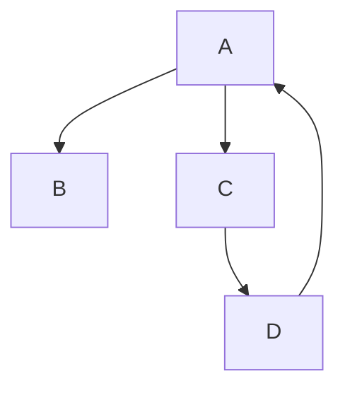

# Semester Project

# Steps
## Signal Generator
Signal Generator - requires
- [ ] Sine ware generated
- [ ] Include some noise
- [ ] Standard Python Packages
- [ ] Send a signal to an outside source

## Python Integration
See requirements.txt
```TEXT
numpy
scipy
pandas
paho-mqtt
```



| Symbol | Step |
| --- | --- |
| A | Generate Sine Wave |
| B | Pass to MQTT Client |
| C | Specify Server for Sending |
| D | Check the ACK |

REPEAT

# Sample Sinewave Generator
```Python
x = np.linspace(0.0, N*T, N, endpoint=False)
y = np.sin(50.0 * 2.0*np.pi*x) + 0.5*np.sin(80.0 * 2.0*np.pi*x)
```
[Reference](https://docs.scipy.org/doc/scipy/tutorial/fft.html)

# OOP

## Class (Signal)
- Generate Signal
    - Expecting to generate a signal that is used to simulate a vibrating item
- [Your Choice]
    - Expecting a different type of signal here

## Class (MQTT)
- Client Connection
    - Configure and connect tor the specified client during message for the particular signal. Note that there might be multiple streams
- Public Variables (*CONF*)
    - Include the Stream information
    - Include the Server information
    - Include the Client

## Class (ACK)
- Error Handling if things fail
    - What to do with the data
    - Where to send the data to if its not working


